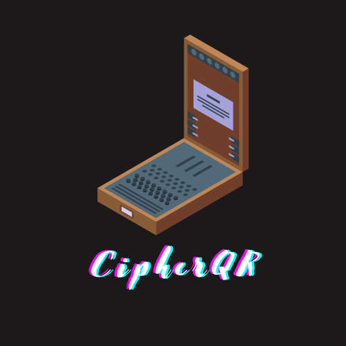

# CipherQR



CipherQR is a Python tool that allows you to encode data within a QR code, break it down into smaller pieces, add a beautiful border, and then reconstruct the QR code to retrieve the data. It's a fun project created by Sanath Swaroop Mulky during their studies at RIT for the MS in Data Science program.

## Author

- **Sanath Swaroop Mulky**
- Website: [https://sanathswaroop.com](https://sanathswaroop.com)
- LinkedIn: [https://www.linkedin.com/in/sanathswaroop/](https://www.linkedin.com/in/sanathswaroop/)


## Execution

To use CipherQR to encode and decode data, follow these steps:

- Original Source Image:
  
  


1. **Generate a QR code** from your data (e.g., a URL):

   ```python
   generate_qr("https://sanathswaroop.com")
   breakdown_qr()
   add_border_to_image()
   ```


- Final Image After Adding Data as Border:
  
  

- Final Reconstructed QR to Get Data Back From the Final Image:

```cut_border_from_image()
```
  
  

Enjoy using CipherQR to create and decode your unique QR codes!
